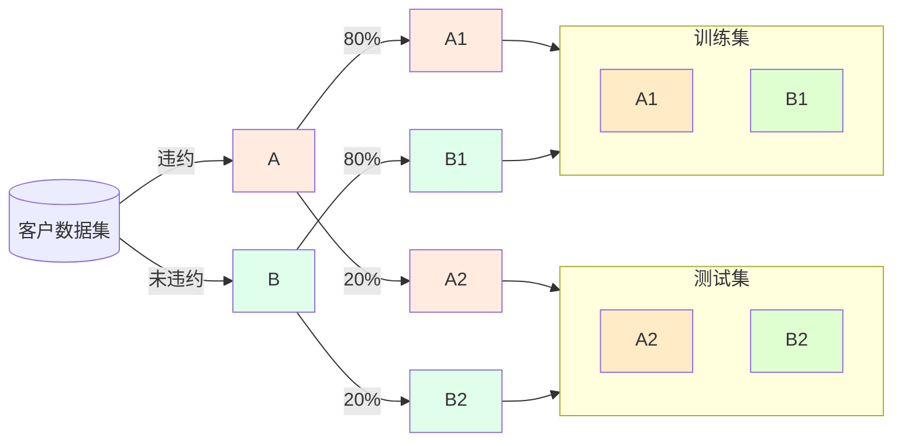
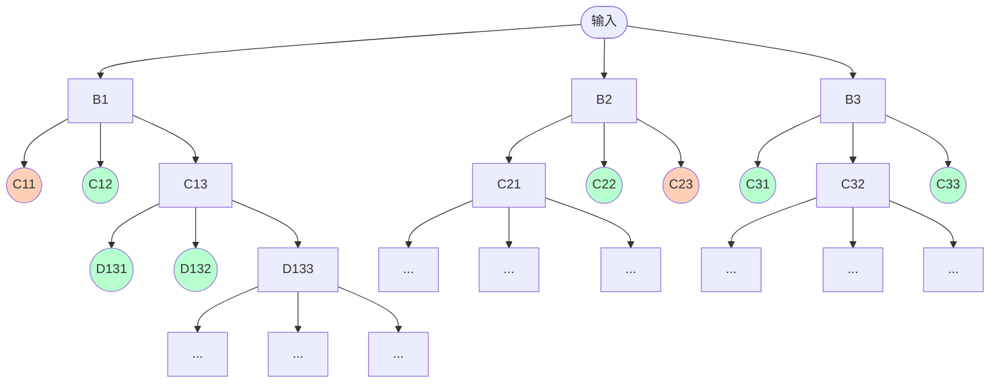

---
# try also 'default' to start simple
theme: seriph
# random image from a curated Unsplash collection by Anthony
# like them? see https://unsplash.com/collections/94734566/slidev
background: https://source.unsplash.com/collection/94734566/1920x1080
# apply any windi css classes to the current slide
class: 'text-center'
# https://sli.dev/custom/highlighters.html
highlighter: shiki
# show line numbers in code blocks
lineNumbers: false
# some information about the slides, markdown enabled
drawings:
  persist: false
# use UnoCSS (experimental)
css: unocss
---

# 智能信息处理综合实践

widcardw

<div class="abs-br m-6 flex gap-2">
  <a href="https://slides.widcard.win/data-process/final" target="_blank" 
    class="text-sm icon-btn opacity-50 !border-none !hover:text-white">
    SPA
  </a>
</div>

---
layout: image-right
image: https://source.unsplash.com/collection/94734566/960x1080
---

# 项目背景

银行信用风险评估

- 数据量持续增大
- 业务规模难以扩大
- 坏账率高
- 评估指标多而冗杂
- 对风险控制要求高

# 项目目标

分析客户信息，预测违约风险

- 客户基本信息
- 信用历史
- 消费与偿还能力
- 监督学习方法建立个人信用风险评估模型

---

# 数据探索与预处理

提取 32 个客户数据字段，预测出其**违约**特征


---

# 数据分析和预处理

<div grid="~ cols-2 gap-4">

<div>

## 数据缺失

| 字段          | 缺失量 |
|:------------- | ----:|
| idVerify       | 25782 |
| maritalStatus  |  7493 |
| threeVerify    |  3494 |
| education      |  3014 |
| sex            |   163 |
| Default        |     2 |

</div>

<div>

## 处理方式

### 离散值

- 取值较为**固定**
- 一般的，填充为 “未知”
- 缺失量较少的值，简单删除，或使用**众数**代替
    - 众数可能会对后续预测有一定的影响
- 缺失量非常大的，统计意义不大，直接**丢弃**

### 连续值

- 取值**不固定**
- 相互关联的数据中，**不符合逻辑**的需要针对处理
- 消费笔数为 0，消费金额接近 0，推测为**精度丢失**
- 消费笔数为 0，消费金额较大
    - 数量较少，进行**合情推测**

</div>

</div>

---

# 离散值的数字编码

<div grid="~ cols-6 gap-4">

| Status |
|:-------------:|
| 已婚          |
| 未婚          |
| 未知          |
| 未婚          |
| 已婚          |

<div flex="~ col">

<div flex-1>

```json
{
    "未知": 0,
    "未婚": 1,
    "已婚": 2
}
```

</div>

$$
\xrightarrow {\quad \text{map} \quad}
$$

<div flex-1 />

</div>

| Status |
|:-------------:|
| 2          |
| 1          |
| 0          |
| 1          |
| 2          |

<div text-center flex="~ col">

<div flex-1 />


$$
\xrightarrow {\text{One-Hot 编码} }
$$

<div flex-1 />

</div>

<div style="grid-column-start: 5; grid-column-end: 7;">

| Status_0 | Status_1 | Status_2 |
|:---------------:|:---------------:|:---------------:|
| 0 | 0 | 1 |
| 0 | 1 | 0 |
| 1 | 0 | 0 |
| 0 | 1 | 0 |
| 0 | 0 | 1 |

</div>

</div>


- 数字编码便于机器进行数据分析，但引入了原本不存在的次序关系
- One-Hot 编码解决直接数字编码引入的原本不存在的次序关系

---

# 数据可视化分析——核密度估计 回归关系


- 核密度估计大部分数据分布在哪一个区域，属于哪一个数量级
- 回归关系得到两个相关联的变量之间大致的线性关系
- 图中网上消费金额和笔数甚至出现了负相关，需要进行合理分析和推测：网上收入

---
layout: two-cols
---

# 数据可视化分析——盒图


::right::

<div>

<div flex>


</div>

<div>

- 盒图能够明确的展示**离群点**的信息，数据是否对称，数据如何分组、数据的峰度
- 能够明显的发现**异常数据**
- 对于分散程度过分的数据，单个盒图**无法观测到一些细节**


</div>

</div>

---

# 建立信用评估指标体系

- 消费能力
    - 年消费总额 = 年消费笔数 × 年消费金额均值
- 总资产
    - 年取现总额 = 年取现笔数均值 × 年取现金额均值
- 资产方面的稳定性
    - 平均每笔取现金额 = 总取现金额 / 总取现笔数
- 网络消费习惯
    - 网上平均每笔消费金额 = 网上消费金额 / 网上消费笔数
- 消费支出情况
    - 公共事业平均每笔缴费额 = 公共事业缴费金额 / 公共事业缴费笔数
- 不良记录评分
    - 不良记录 = 法院失信传唤记录 + 有无逾期记录 + 有无犯罪记录 + 黑名单接口记录不良记录

```python
data <= ['trans_total', 'total_withdraw', 'avg_per_withdraw', 
         'avg_per_online_spend', 'avg_per_public_spend', 'bad_record']
```

---

# 构建风控模型流程

基于信用指标体系，构建风控模型


- 本实训中所做的是一个**二分类**模型
    - 逻辑回归模型
    - 随机森林模型
    - SVM
    - ……


---

# 分层采样

构建模型和评估效果





- 分别对**每个类别**进行随机采样
- 保证在采样空间或类型选取上的**均匀性**及**代表性**

---

# 使用逻辑回归建立风险评估模型

<div grid="~ cols-2 gap-2">

<div>

- 对于每个特征的线性加权形式

$$
y=w_1x_1+\cdots + w_dx_d +w_0=\mathbf{w}^\mathrm{T} \mathbf{x}_i
$$

- 利用 Logistic 函数，属于正类的概率

$$
p(y=1 \mid \mathbf{x}_i)={1 \over 1 + \exp(- \mathbf{w}^\mathrm{T} \mathbf{x}_i)}
$$


</div>

<div>

- 使用 AUC 值评估模型的准确性


|迭代次数| L1 | L2 |
|:----:|:--------:|:-------:|
|默认|0.877696729|0.613901718|
|100|0.877713231|0.864659606|

- 在默认参数下，L2 效果不好的原因是模型**未收敛**
- 在收敛后，AUC 值得到了明显的提升

</div>

</div>

---
layout: two-cols
---

# 正则化

减少模型的过拟合的可能

限制模型中参数，让模型的参数不会太大

$$
\begin{aligned}
L1: -\ln L(\mathbf{w})&=-\sum_i \cdots + {1\over 2b^2}\sum_j|w_j|\\
L2: -\ln L(\mathbf{w})&=-\sum_i \cdots + {1 \over 2 \sigma^2}\mathbf{w}^\mathrm{T} \mathbf{w}
\end{aligned}
$$

- L1 正则化会学习地去掉无用的特征，将权重置 0，参数会更加稀疏
- L2 正则化会逼迫 $w$ 尽可能趋向于 0，但不会等于 0，参数变小但是会比较平滑

::right::

$C$ 是正则化强度 $\lambda$ 的倒数，是用来控制正则化程度的超参数。
$C$ 越小，损失函数越小，模型对损失函数的惩罚越重，正则化效力越强。

$$
\begin{aligned}
J(\mathbf{w})_{L1} & = C \cdot J(\mathbf{w}) + \sum_j |w_j| \\
J(\mathbf{w})_{L2} & = C \cdot J(\mathbf{w}) + \sqrt{\sum_j |w_j|^2 }
\end{aligned}
$$


---
layout: two-cols
---

# 正规化

部分值取值分散，跨度大，对模型预测有影响

Z-score 标准化

$$
X \sim N(\mu,\sigma^2) \Rightarrow {X - \mu \over \sigma} \sim N(0, 1)
$$

|    项目 | 标准化前 | 标准化后 |
|:------:|:-------:|:-------:|
| 均值 |1471.6337|5.7645e-17|
| 标准差 | 2892.2593 | 0.9999 |
| AUC | 0.8777 | 0.8775 |

::right::

# 离散化

离散特征的增加和减少都很容易，易于模型的**快速迭代**

| 范围 | $0\sim 30$ | $31\sim 100$ | $101\sim1000$ | $\cdots$ |
|:---:|:---:|:---:|:---:|:---:|
| 分类 | cate_0 | cate_1 | cate_2 | $\cdots$ |


---

# 使用随机森林建立风险评估模型

每一棵决策树分别判断和分类，得到结果哪个分类最多，这个结果就作为输出

- 参数影响因素：决策树的数量、深度等

<div style="width: 80%; margin: -40px auto;">



</div>

---

# 模型准确性的评估标准——AUC 值

<RocPlot mt--1rem />

---

# 模型准确性的评估标准——AUC 值

<div grid="~ cols-2">


</div>

- ROC 曲线越接近左上角，模型效果越好，但结合实际情况，可以对阈值进行不同的划分
    - 我们可以接受扫描多次指纹，但不能接受小偷的指纹能够开锁——FPR 尽可能小，敏感度可以适当降低

---
layout: two-cols
---

# PR 曲线


::right::

- PR 曲线针对正负样本数量差距及其**悬殊**的数据来说，能够有更好的参考价值
- 当样本变化时，ROC 曲线有更好的鲁棒性
    - Precision 变量同时与实际正负例都有关

$$
\begin{aligned}
P & = { {\color{red}TP} \over {\color{red}TP} + {\color{green}FP} } \\
R & = { {\color{red}TP} \over {\color{red}TP} + {\color{red}FN} }
\end{aligned}
$$


---
layout: two-cols
---

# PSI

评估模型稳定性

$$
PSI = \sum\left((\text{actual} - \text{predict}) \cdot \ln {\text{actual} \over \text{predict} }\right)
$$

- 当一个事件发生的概率**越大**，其携带的信息量**越少**
    - 福葛每次考试都第一名，下次考试他考第一名
    - 信息量 $I(x)=-\ln (0.99)\approx 0.01$
- 我们想要预测的模型**越稳定越好**，预测**越准越好**
    - 与实际情况差别越小，即**从训练模型到测试模型**所需要的**信息量越少**
    - 交叉熵 $H_q(p)$ 度量了 $q$ 到 $p$ 还需要的信息量

$$
\begin{aligned}
H_q(p)&=-\sum p(x) \log q(x) \\
D_q(p) &= H_q(p) - H(p)
\end{aligned}
$$

::right::

# Entropy

熵

$$
H = - \sum p(x) \log p(x)
$$

有两组样本 $P,Q$，其损失（相对熵）为

$$
\begin{aligned}
D(p||q)&=H(p,q)-H(p) \\
&=\sum p(x)(\log p(x)-\log q(x))\\
&=E_p[\log p(x)-\log q(x)] \\
&=\sum p(x)\log{ p(x) \over q(x)}
\end{aligned}
$$

这个量对 $P,Q$ 是不对称的，两个值求和可以使其对称

$$
\begin{aligned}
D(p||q)+D(q||p) = \sum (p(x)-q(x))\log{ p(x) \over q(x)}
\end{aligned}
$$

---

# 测试

| 逻辑回归| PSI | $D(\text{a}, \text{e})$ | $D(\text{e}, \text{a})$ | 随机森林 | PSI | $D(\text{a}, \text{e})$ | $D(\text{e}, \text{a})$ |
|:---:|:---:|:---:|:---:|:---:|:---:|:---:|:---:|
|数值|0.000923428|0.000463127| 0.000460301|数值|0.00912787 |0.00462177|0.00450609 |

<div grid="~ cols-2">


</div>